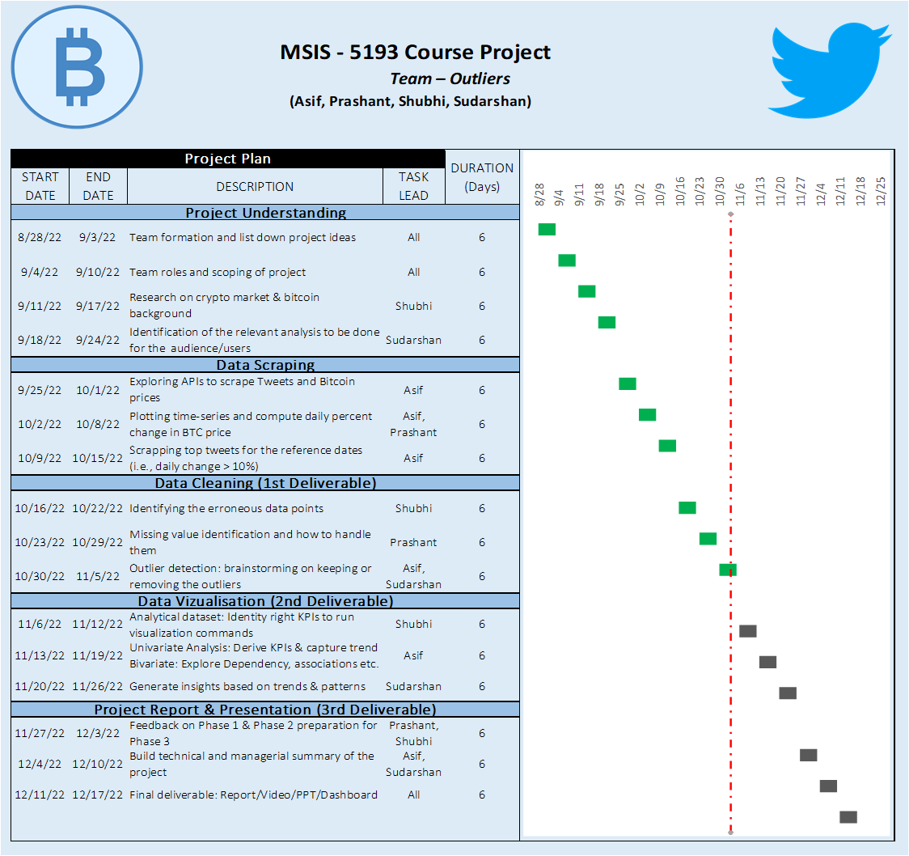
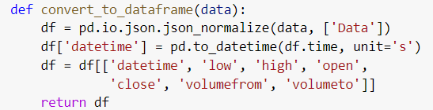

# How does the Twitter world react just before Bitcoin soars or crashes?

## Executive Summary: 

“70% of the planet is covered by the water, the rest by Crypto enthusiasts” 

One only needs to count the number of crypto-related accounts on the twitter to verify the above statement. Via this project, we are trying to understand the mood in the crypto camp of twitter just before any major fluctuation occurs in the Bitcoin price. 

The general public considers it unsafe to invest in the crypto market because of its unpredictability. Hence, we aim to tackle this unpredictability by looking for the key words that are frequently used in the tweets posted just before the price fluctuation. We are also analyzing the sentiment of these tweets to see if the mood in the Twitter's crypto camp could be a good indicator of what's about to come next!

This analysis mainly benefits the financial investors and the crypto enthusiasts in assessing the crypto market by looking at the twitter trends.  

## Statement of Scope

Project objectives: 

* To extract the dates when there was a great increase or decrease in the closing prices of the Bitcoin compared to the preceding days. 

* To scrape the top tweets related to Bitcoin and crypto posted within the two days range before the dates of interest obtained in the above step. 

* To clean the text of these tweets by removing the stop words and lemmatizing the words in the remaining text.

* To perform exploratory data analysis on the cleaned text to visualize the list of frequent key words in the tweets.

* To perform sentiment analysis on the cleaned text.

Unit of analysis: 

* The top tweet results corresponding to the search of keywords ‘Bitcoin’, ‘BTC’ and ‘crypto’ in Twitter.  

## Project Schedule

## Data Preparation

## Data Access: 

We first needed to extract the historical Bitcoin prices by day data. We used Cryptocompare API’s free tier (https://min-api.cryptocompare.com/) by limiting the number of records returned to 2000.  

This API call required a few input parameters specified in the below screenshot: 

The response of this API call was returned as a JSON file which included the following sections – date, lowest price, highest price, opening price, closing price, the total volume of stocks traded from base currency (bitcoin) to quote currency and the total volume of stocks traded from quote currency to base currency (bitcoin). 

We converted this result from the JSON format to a Pandas dataframe.  

* We now had the historical bitcoin price data between 2017 to 2022 in the timeseries format. 

Later, after doing some data cleaning and data reduction on this dataframe , we zeroed in on 74 dates when Bitcoin had more than 10% change in its closing price compared to the previous days. (Covered in detail in next sections). These dates were stored in a new dataframe - ‘df_dates’: 

Later, in order to capture the two-day interval preceding these dates, we subtracted one day and two days from these dates and stored them in new columns. 

Next, we opted to perform dynamic web scraping of Twitter using Selenium. Once after authenticating the Twitter, we used the Twitter’s advanced search functionality for searching tweets based on a list of keywords and the time interval: 

After clicking the search button, we noticed that these parameters were directly captured in Twitter’s URL: 

Hence, we figured out that we could directly manipulate the date range in this URL as ‘UNTIL (Date_BTC_Crash_or_Soar – 1 day), SINCE (Date_BTC_Crash_or_Soar – 2 days) to scrape the tweets. 

The below screenshot demonstrates the manipulation of this URL for all the dates in df_dates dataframe: 

Next, we scraped the element div from the Twitter page which has the attribute ‘data-testid’ as ‘tweetText’: 

We stored this text information in the dataframe, along with the original date when Bitcoin either soared or crashed as the reference date for each tweet. (NOTE: we did not capture the actual date of tweet, which could be one or two days before the reference date.) 

* [tweets.csv](data/tweets.csv) - The final dataset generated for this project
* [Python code for accessing Bitcoin data and cleaning it](code/btc_data_access_and_cleaning.py) 
* [Python code for twitter scraping, cleaning the tweets and merging the data](code/twitter_scraping_and_cleaning_the_tweets.py)

### Data Cleaning

The cryptocompare API’s response contained a few empty data points, which were subsequently captured in the dataframe as null values. We filtered those null values as below:  

Also, the tweet text extracted contained URLs of external websites, retweet URLs, new line characters, dollar symbols etc. Since these won’t be useful to the ultimate text analysis, we replaced these characters in the text using regex as below: 

### Data Transformation

The dataframe created with the original response of Cryptocompare’s API contained the Closing price column. In order to compute the percentage change in closing price with respect to previous day, we created a new column that is the lagged version of the closing price column shifted down by one position. 

Later, we computed the percentage change as below and stored it in a new column: 

### Data Reduction

* The timeseries data we initially extracted from the API had 2001 rows and 7 columns. We later added a new column for the previous day closing price as discussed in the above section. 

* Since we only needed three columns from this data for our analysis (date, closing price and previous day price), we decided to keep only these columns while copying data to a new dataframe.  

* Later, we created a new column to calculate the percentage change, which was also discussed in the above section. 

* We used this new percentage change column to filter the dates where the percentage change was greater than 10%: 

* The dates of interest reduced to 74 after this filtering action. Later, we scraped the tweets of bitcoin by taking these 74 dates as reference.  

### Data Consolidation

* After scraping the tweets data, we stored the text in a new dataframe. But this text alone won’t provide much value to the analysis, hence we decided to include the reference date for these tweets from the bitcoin table. 

* Later, we merged the date column and text column in new dataframe as below: 

* Next, we merged this dataframe with the bitcoin table as below:

### Data Dictionary

A short description of the table below. Be sure to link each row to a data file in your directory `data` so I know where it is stored.

| Attribute Name | Description | Data Type | Source | Data | Example |
|:---|:---|:---:|:---|:---|:---:|
| Reference date | The date on which BTC price soared or crashed by more than 10% | datetime | https://min-api.cryptocompare.com/ | [tweets.csv](data/tweets.csv) | 2020-09-24 |
| Tweet text | Text of the tweets posted one or two days before the reference date | char(280) | http://www.twitter.com | [tweets.csv](data/tweets.csv) | Tweets like - "The white paper of bitcoin is in the public streets of Scotland."; "Apple Pay vs. Google Pay. vs. Bitcoin"; etc.  |
| close | Closing price of BTC on the reference date | float | https://min-api.cryptocompare.com/ | [tweets.csv](data/tweets.csv) | 2226 |
| prev | Closing price of BTC on reference date - 1 day  | float | https://min-api.cryptocompare.com/ | [tweets.csv](data/tweets.csv) | 1917.63 |
| per | Percent change between close and prev columns | float | https://min-api.cryptocompare.com/ | [tweets.csv](data/tweets.csv) | 16.08  |

### Data Viz

## Conclusion and Discussion

* We relied on the cryptocompare API for gathering the historical bitcoin data, but this API was limited in terms of the functionality it provided for its free tier. We had limitations in terms of the number of API calls we could make per day, which made our task difficult. Next time, we could probably scrape this data ourselves from websites like Yahoo Finance instead of relying on the APIs. 

* And we initially planned to scrape all tweets with the bitcoin hashtag posted in the past. But the twitter’s official API too limited the ability to access historical data by restricting the last date for which one could extract the tweets to “current day – one week”. Hence, we had to dynamically scrape the twitter data by manipulating twitter search URL. We explored other alternatives like Twint library in Python, but it took forever to scrape the tweets which made it an unviable option for us. Next time, we would instead opt to look at the trends in platforms like Reddit which do not have as many restrictions as Twitter on the functionalities of the API’s free tier. 

* From our analysis, we hope to establish a few trends and correlations between the increased frequency of certain words appearing in tweets with the soaring or crashing of BitCoin price in near future. It will help financial institutions make better decisions about their Crypto investments and provide an opportunity for financial brokers to better their business. 
